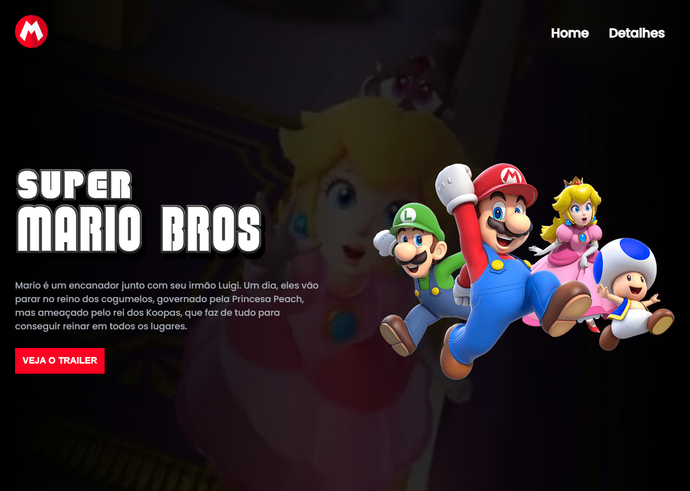

# Super Mario Bros 🍄

> Projeto desenvolvido durante o evento MapaDev Week

## 💻 Desktop

## 🚀 Tecnologias

- HTML
- CSS
- JavaScript

[🔗 Clique aqui para acessar](https://brunakarina.github.io./super-mario-bros/)

## 📫 Contato

  
  

 

<h4 align="center">Made with ❤ by Bruna Karina 👋🏻</h4>